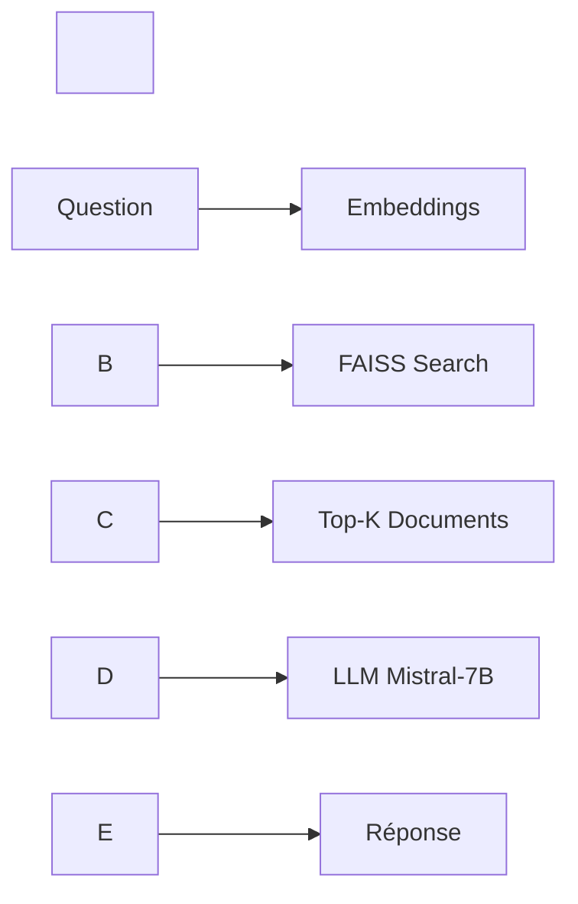

# chatbot-memoire

Voici un chatbot intelligent lié à un mémoire de fin d'études effectué au sein de Smart Automation Technologies

\# 🎓 Chatbot de Recherche Académique - Assistant IA pour Mémoire


\[!\[Streamlit](https://img.shields.io/badge/Streamlit-FF4B4B?style=for-the-badge\&logo=Streamlit\&logoColor=white)](https://streamlit.io/)

\[!\[LangChain](https://img.shields.io/badge/LangChain-121212?style=for-the-badge\&logo=chainlink\&logoColor=white)](https://www.langchain.com/)

\[!\[Hugging Face](https://img.shields.io/badge/Hugging%20Face-FFD21E?style=for-the-badge\&logo=huggingface\&logoColor=black)](https://huggingface.co/)

\[!\[Python](https://img.shields.io/badge/Python-3776AB?style=for-the-badge\&logo=python\&logoColor=white)](https://www.python.org/)


\## 📖 Description


Assistant IA intelligent conçu pour interroger et explorer un mémoire de fin d'études en Data Science. Ce chatbot utilise des techniques de \*\*Retrieval Augmented Generation (RAG)\*\* pour répondre à des questions académiques de manière précise et contextuelle.


\### 🎯 Projet de Recherche


\*\*Titre du mémoire :\*\*  

\*"Approches intelligentes et mathématiques pour analyser le churn client dans le e-commerce"\*


\*\*Niveau :\*\* Master en Modélisation Mathématique et Science de Données


\*\*Domaines couverts :\*\*

\- Modèles de survie (CoxPH, Weibull AFT, DeepSurv, DeepHit)

\- Analyse du churn client

\- Machine Learning et Deep Learning appliqués au e-commerce

\- Feature engineering et analyse temporelle


---


\## 🚀 Technologies Utilisées


| Composant | Technologie | Rôle |

|-----------|------------|------|

| \*\*LLM\*\* | Mistral-7B-Instruct-v0.2 | Génération de réponses |

| \*\*Embeddings\*\* | all-MiniLM-L6-v2 | Vectorisation du texte |

| \*\*Vector Store\*\* | FAISS | Recherche sémantique |

| \*\*Orchestration\*\* | LangChain | Pipeline RAG |

| \*\*Interface\*\* | Streamlit | Interface utilisateur |

| \*\*Hébergement\*\* | Streamlit Cloud | Déploiement gratuit |


✅ \*\*100% Open-Source et Gratuit\*\*


---


\## 📂 Structure du Projet


```

chatbot-memoire/

│

├── chatbot\_memoire.py       # Application Streamlit principale

├── requirements.txt          # Dépendances Python

├── README.md                 # Documentation (ce fichier)

├── .env.example              # Template de configuration

├── .gitignore                # Fichiers à ignorer

│

├── data/

│   └── memoire.pdf           # Mémoire de recherche (à ajouter)

│

└── vector\_store/

&nbsp;   └── faiss\_index/          # Base vectorielle (auto-générée)

```


---


\## ⚙️ Installation et Exécution Locale


\### Prérequis


\- Python 3.9 ou supérieur

\- pip

\- Un compte Hugging Face (gratuit)


\### Étapes d'installation


1\. \*\*Cloner le dépôt\*\*

```bash

git clone https://github.com/votre-username/chatbot-memoire.git

cd chatbot-memoire

```


2\. \*\*Créer un environnement virtuel\*\* (recommandé)

```bash

python -m venv venv

source venv/bin/activate  # Sur Windows : venv\\Scripts\\activate

```


3\. \*\*Installer les dépendances\*\*

```bash

pip install -r requirements.txt

```


4\. \*\*Configurer le token Hugging Face\*\*


&nbsp;  a. Créez un compte sur \[Hugging Face](https://huggingface.co/)

&nbsp;  

&nbsp;  b. Générez un token : \[Settings > Access Tokens](https://huggingface.co/settings/tokens)

&nbsp;  

&nbsp;  c. Copiez `.env.example` en `.env` :

&nbsp;  ```bash

&nbsp;  cp .env.example .env

&nbsp;  ```

&nbsp;  

&nbsp;  d. Éditez `.env` et ajoutez votre token :

&nbsp;  ```

&nbsp;  HUGGINGFACE\_API\_TOKEN=hf\_votre\_token\_ici

&nbsp;  ```


5\. \*\*Ajouter votre mémoire\*\*


&nbsp;  Placez votre fichier PDF dans `data/memoire.pdf`


6\. \*\*Lancer l'application\*\*

```bash

streamlit run chatbot\_memoire.py

```


L'application s'ouvrira automatiquement dans votre navigateur à `http://localhost:8501`


---


\## ☁️ Déploiement sur Streamlit Cloud


\### 1. Préparer le dépôt GitHub


\- Assurez-vous que `.env` est dans `.gitignore` (ne jamais commit le token !)

\- Poussez votre code sur GitHub :


```bash

git add .

git commit -m "Initial commit"

git push origin main

```


\### 2. Déployer sur Streamlit Cloud


1\. Allez sur \[share.streamlit.io](https://share.streamlit.io/)

2\. Cliquez sur \*\*"New app"\*\*

3\. Sélectionnez votre dépôt GitHub

4\. Configurez :

&nbsp;  - \*\*Main file path:\*\* `chatbot\_memoire.py`

&nbsp;  - \*\*Python version:\*\* 3.9+


\### 3. Ajouter le token en secret


Dans les paramètres de l'app Streamlit Cloud :


1\. Allez dans \*\*"Advanced settings"\*\* → \*\*"Secrets"\*\*

2\. Ajoutez :

```toml

HUGGINGFACE\_API\_TOKEN = "hf\_votre\_token\_ici"

```


\### 4. Ajouter le fichier PDF


⚠️ \*\*Important :\*\* Le fichier PDF doit être dans le dépôt GitHub dans `data/memoire.pdf`


> \*\*Note :\*\* Si votre mémoire est confidentiel, ne le publiez pas publiquement. Utilisez un dépôt privé ou déployez uniquement localement.


---


\## 🎯 Fonctionnalités


\### ✨ Caractéristiques principales


\- 🤖 \*\*Réponses contextuelles\*\* basées sur le contenu du mémoire

\- 🔍 \*\*Recherche sémantique\*\* via embeddings et FAISS

\- 📚 \*\*Citations des sources\*\* avec numéros de pages

\- ⚡ \*\*Performance optimisée\*\* avec cache Streamlit

\- 🎨 \*\*Interface intuitive\*\* et responsive

\- 🔒 \*\*Gestion sécurisée\*\* des tokens API


\### 💬 Exemples de questions


```

\- Quels sont les modèles de survie utilisés dans ce mémoire ?

\- Explique le modèle DeepSurv et ses avantages

\- Quelles sont les principales métriques d'évaluation ?

\- Comment le feature engineering a-t-il été réalisé ?

\- Résume les conclusions du mémoire

```


---


\## 🛠️ Architecture Technique


\### Pipeline RAG





\### Composants clés


1\. \*\*Chargement du PDF\*\* : PyPDFLoader

2\. \*\*Découpage\*\* : RecursiveCharacterTextSplitter (1000 tokens, overlap 200)

3\. \*\*Vectorisation\*\* : SentenceTransformers

4\. \*\*Indexation\*\* : FAISS (Similarity Search)

5\. \*\*Génération\*\* : Mistral-7B via Hugging Face API

6\. \*\*Orchestration\*\* : LangChain RetrievalQA


---


\## 📊 Configuration Avancée


\### Personnalisation du modèle


Dans `chatbot\_memoire.py`, modifiez :


```python

\# Changer le LLM

LLM\_MODEL = "HuggingFaceH4/zephyr-7b-alpha"


\# Ajuster les paramètres

CHUNK\_SIZE = 800

CHUNK\_OVERLAP = 150

```


\### Optimisation de la recherche


```python

\# Dans create\_qa\_chain()

retriever=vector\_store.as\_retriever(

&nbsp;   search\_type="mmr",  # Maximum Marginal Relevance

&nbsp;   search\_kwargs={"k": 5, "fetch\_k": 10}

)

```


---


\## 🐛 Résolution de Problèmes


\### Erreur : "Token Hugging Face manquant"

\- Vérifiez que `.env` existe et contient `HUGGINGFACE\_API\_TOKEN`

\- Sur Streamlit Cloud, vérifiez les Secrets


\### Erreur : "Fichier PDF introuvable"

\- Assurez-vous que `data/memoire.pdf` existe

\- Vérifiez le chemin relatif


\### Lenteur de l'application

\- La première exécution crée la base vectorielle (normal)

\- Les suivantes utilisent le cache FAISS


\### Erreur FAISS

```bash

\# Sur certains systèmes, utilisez faiss-gpu si disponible

pip install faiss-gpu

```


---


\## 🤝 Contribution


Les contributions sont les bienvenues ! Pour contribuer :


1\. Fork le projet

2\. Créez une branche (`git checkout -b feature/amelioration`)

3\. Commit vos changements (`git commit -m 'Ajout fonctionnalité'`)

4\. Push (`git push origin feature/amelioration`)

5\. Ouvrez une Pull Request


---


\## 📝 Licence


Ce projet est sous licence MIT. Voir le fichier `LICENSE` pour plus de détails.


---


\## 👨‍🎓 Auteur


\*\*Projet académique\*\* - Master Modélisation Mathématique et Science de Données


📧 Contact : \[votre-email@exemple.com]  

🔗 LinkedIn : \[Votre profil]  

🐙 GitHub : \[votre-username]


---


\## 🙏 Remerciements


\- \[LangChain](https://www.langchain.com/) - Framework d'orchestration

\- \[Hugging Face](https://huggingface.co/) - Modèles open-source

\- \[Streamlit](https://streamlit.io/) - Interface utilisateur

\- \[FAISS](https://github.com/facebookresearch/faiss) - Recherche vectorielle


---


\## 📚 Ressources Supplémentaires


\- \[Documentation LangChain](https://python.langchain.com/)

\- \[Guide RAG](https://www.langchain.com/rag)

\- \[Tutoriel Streamlit](https://docs.streamlit.io/)

\- \[Hugging Face Inference API](https://huggingface.co/docs/api-inference/)


---


<div align="center">


\*\*⭐ Si ce projet vous a aidé, n'oubliez pas de lui donner une étoile sur GitHub ! ⭐\*\*


Made with ❤️ and 🤖


</div>


